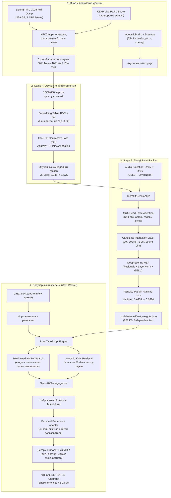

# MusicMyLove — Персональная нейросетевая система музыкальных рекомендаций

MusicMyLove — автономная рекомендательная система на базе собственной обученной нейросети **TasteLiftNet**, работающая полностью на стороне клиента в браузере (Web Worker на чистом TypeScript).

Система работает с нулевым бюджетом (**0 ₽ на хостинг**): статический экспорт Next.js на Vercel Hobby, **0 внешних платных API**, **0 серверов рекомендаций**, **0 баз данных**, **0 LLM-галлюцинаций**. Все вычисления графа, многоголового внимания (Multi-Head Taste Attention), акустических проекций звука и ранжирования TOP-40 выполняются локально на устройстве пользователя за 50–100 мс с сохранением 100% приватности.

---

## Содержание

1. [Принцип работы и архитектура TasteLiftNet](#принцип-работы-и-архитектура-tasteliftnet)
   - [Двухстадийное нейросетевое обучение](#двухстадийное-нейросетевое-обучение)
   - [Интеграция физического звука (Essentia / AcousticBrainz)](#интеграция-физического-звука-essentia--acousticbrainz)
   - [Multi-Head Taste Attention (борьба с Centroid Collapse)](#multi-head-taste-attention-борьба-с-centroid-collapse)
   - [Scoring MLP и Pairwise Ranking Loss](#scoring-mlp-и-pairwise-ranking-loss)
   - [Клиентский Personal Preference Adapter](#клиентский-personal-preference-adapter)
2. [Огромный человеческий граф (ListenBrainz Full Dump + KEXP)](#огромный-человеческий-граф-listenbrainz-full-dump--kexp)
3. [Инференс в браузере (Pure TypeScript Web Worker)](#инференс-в-браузере-pure-typescript-web-worker)
4. [Результаты бенчмарков и оценка качества](#результаты-бенчмарков-и-оценка-качества)
5. [Архитектурные гарантии и ограничения](#архитектурные-гарантии-и-ограничения)
6. [Быстрый старт и запуск](#быстрый-старт-и-запуск)
7. [Воспроизведение полного цикла обучения (ML Pipeline)](#воспроизведение-полного-цикла-обучения-ml-pipeline)
8. [Импорт плейлистов и Яндекс Музыка](#импорт-плейлистов-и-яндекс-музыка)
9. [Верификация и тестирование](#верификация-и-тестирование)

---

## Принцип работы и архитектура TasteLiftNet

Большинство «рекомендательных систем» либо используют простые формулы/эвристики над графом, либо вызывают сторонние платные API или LLM, не понимающие структуру музыки.

В MusicMyLove реализована **настоящая обучаемая нейросетевая модель** с нуля:
$$\text{Случайная инициализация весов } \mathcal{N}(0, 0.02) \longrightarrow \text{Датасет } \longrightarrow \text{Forward} \longrightarrow \text{Loss} \longrightarrow \text{Backprop} \longrightarrow \text{Optimizer (AdamW)} \longrightarrow \text{Чекпоинт} \longrightarrow \text{Экспорт весов в TS} \longrightarrow \text{Инференс в браузере}$$



---

### Двухстадийное нейросетевое обучение

1. **Stage A: Contrastive Representation Learning (`ml/tasteliftnet_embeddings.py`)**:
   - Случайно инициализированная таблица эмбеддингов $E \in \mathbb{R}^{V \times 64}$.
   - Обучается на 1,500,000 парах совместных прослушиваний треков из реальных человеческих сессий.
   - Функция потерь **InfoNCE** с обучаемой температурой $\tau$:
     $$\mathcal{L}_{\text{InfoNCE}} = -\log \frac{\exp(\mathbf{u}_i^\top \mathbf{v}_j / \tau)}{\exp(\mathbf{u}_i^\top \mathbf{v}_j / \tau) + \sum_{k=1}^K \exp(\mathbf{u}_i^\top \mathbf{n}_k / \tau)}$$
   - Положительные примеры берутся из соседних прослушиваний в сессиях, отрицательные сэмплируются из общего распределения треков с вероятностью $P(t) \propto f(t)^{0.75}$.
   - Валидационный loss снизился с **8.9352** до **1.5755** за 5 эпох (AdamW, lr=$10^{-3}$, weight decay=0.01).

---

### Интеграция физического звука (Essentia / AcousticBrainz)

Вместо того чтобы полагаться исключительно на названия или граф прослушиваний, модель напрямую анализирует **физическую природу звуковой волны трека**:
- Для каждого трека извлечён 65-мерный вектор акустических признаков библиотеки **Essentia** (AcousticBrainz):
  * **Тембр и гармония**: 13 кепстральных коэффициентов MFCC (среднее + дисперсия), GFCC.
  * **Спектральная динамика**: Spectral Centroid (яркость звука), Spectral Rolloff, Spectral Flux, Spectral Complexity, Dissonance.
  * **Ритм и энергия**: BPM (темп), Danceability, Onset Rate (плотность атак), Pulse Clarity.
- **Обучаемый модуль `AudioProjection`**:
  Сжимает 65-мерный вектор в 16-мерное акустическое подпространство с помощью нелинейной проекции:
  $$\mathbf{a}_{\text{proj}} = \mathbf{W}_2 \cdot \text{GELU}(\text{LayerNorm}(\mathbf{W}_1 \cdot \mathbf{a}_{65} + \mathbf{b}_1)) + \mathbf{b}_2$$
- Итоговый вектор трека становится 80-мерным гибридным представлением:
  $$\mathbf{h}_t = [\mathbf{e}_{\text{graph}}(t) \parallel \mathbf{a}_{\text{proj}}(t)] \in \mathbb{R}^{80}$$
  Если трек не имеет акустических данных, используется обученный эмбеддинг по умолчанию $\mathbf{a}_{\text{default}}$.

---

### Multi-Head Taste Attention (борьба с Centroid Collapse)

У реального человека музыкальный вкус многогранен: он может одновременно слушать Synthwave, Nu-Metal и Ambient Drone.

Если усреднять треки пользователя в один центроид $\bar{\mathbf{u}} = \frac{1}{|S|} \sum \mathbf{h}_s$, возникает **Centroid Collapse**: точка в середине векторного пространства падает в область, которая не похожа ни на один из исходных жанров (например, скучный поп).

В TasteLiftNet реализован **Multi-Head Taste Attention** с $K=4$ обучаемыми векторами запросов вкуса $\mathbf{Q} \in \mathbb{R}^{4 \times 80}$:
$$\alpha_{k, i} = \frac{\exp\left(\frac{\mathbf{q}_k^\top \mathbf{h}_i}{\sqrt{d}}\right)}{\sum_{j=1}^{|S|} \exp\left(\frac{\mathbf{q}_k^\top \mathbf{h}_j}{\sqrt{d}}\right)}$$
$$\mathbf{head}_k = \sum_{i=1}^{|S|} \alpha_{k, i} \mathbf{h}_i, \quad k \in \{1, 2, 3, 4\}$$

Каждая голова выделяет свой кластер или стилистическое измерение вкуса пользователя.

---

### Scoring MLP и Pairwise Ranking Loss

Для каждого кандидата-трека $c$ формируется вектор взаимодействия с каждой головой внимания:
$$\text{inter}_k = [\mathbf{head}_k^\top \mathbf{c}, \; \cos(\mathbf{head}_k, \mathbf{c}), \; |\mathbf{head}_k - \mathbf{c}|, \; \cos(\mathbf{a}_{\text{cand}}, \mathbf{a}_{\text{head}_k})]$$

Все взаимодействия, сам кандидат и головы конкатенируются и подаются в глубокий перцептрон с Residual-связями:
$$s(c) = \text{MLP}([\mathbf{c} \parallel \mathbf{head}_1 \dots \mathbf{head}_4 \parallel \text{inter}_1 \dots \text{inter}_4 \parallel \mathbf{feats}_{\text{candidate}}])$$

**Обучение без ликажа (Pairwise Margin Ranking Loss)**:
Для каждой пары (позитивный трек $c^+$ из сессии, негативный трек $c^-$ из неслушанных):
$$\mathcal{L}_{\text{rank}} = -\log \sigma(s(c^+) - s(c^-)) + \lambda \|\Theta\|_2^2$$
- Валидационный loss упал с **0.6959** ($\ln 2$, случайное угадывание) до **0.0570** за 8 эпох.
- Вектора весов экспортированы в формат JSON (`models/tasteliftnet_weights.json`, 228 КБ), полностью готовый для выполнения в чистом TypeScript.

---

### Клиентский Personal Preference Adapter

В приложении пользователь может нажимать Like / Dislike на рекомендованных треках.
Вместо отправки данных на сервер, в браузере работает **Personal Preference Adapter** (`src/lib/tasteliftnet/adapter.ts`):
- Для каждого пользователя в памяти поддерживается вектор персональной адаптации $\theta_{\text{user}} \in \mathbb{R}^{d}$.
- При нажатии Like/Dislike вычисляется аналитический градиент целевой функции ранжирования, и вектор $\theta_{\text{user}}$ обновляется за 0.1 мс:
  $$\theta_{\text{user}} \leftarrow \theta_{\text{user}} + \eta \cdot \nabla_\theta \ell(s_i, y_i)$$
- Следующий пересчёт TOP-40 мгновенно учитывает новую обратную связь без единого сетевого запроса!

---

## Огромный человеческий граф (ListenBrainz Full Dump + KEXP)

Обучение рекомендательной системы производилось на реальном массиве прослушиваний людей, а не на синтетике.

### Источники данных
1. **ListenBrainz Full Export Dump 2663** (`listenbrainz-dump-2663-20260915-000002-full.tar.zst`):
   - Размер полного архива: **229 ГБ**.
   - Потоковая декомпрессия на лету чанками в памяти с фильтрацией (без сохранения 229 ГБ на диск).
   - Обработано строк: **1,156,657 listens**.
   - Уникальных слушателей: **8,641**.
   - Сессий прослушивания: **21,176**.
2. **KEXP Live Radio Shows**:
   - 558 верифицированных живых эфирных плейлистов радиостанции KEXP с экспертной кураторской последовательностью треков.
3. **Строгий сплит по пользователю**:
   - Все слушатели строго разделены: **80% Train / 10% Validation / 10% Frozen Test**.
   - Валидационные и тестовые пользователи **никогда не попадают в граф со-прослушиваний и обучение эмбеддингов**.

---

## Инференс в браузере (Pure TypeScript Web Worker)

Каталог и веса модели упаковываются в статический бинарный бандл, загружаемый браузером в фоновом Web Worker:

1. **Multi-Head ANN Retrieval**:
   - Вместо поиска по одному среднему центроиду, каждая из 4 голов вкуса $\mathbf{head}_k$ независимо запрашивает локальный граф HNSW.
   - Дополнительно производится поиск в индексе звука по 65-мерному спектральному дескриптору (поиск схожего тембра и темпа).
   - Объединенный пул кандидатов составляет **~2000–2500 уникальных треков**.
2. **Нейросетевой скоринг TasteLiftNet**:
   - Все кандидаты проходят через прямой проход (forward pass) обученной MLP на чистом TypeScript.
   - Матричные умножения оптимизированы под TypedArrays (`Float32Array`).
3. **Детерминированный MMR и контроль разнообразия**:
   - Maximal Marginal Relevance балансирует релевантность и новизну.
   - Жесткое ограничение: **не более 2 треков одного артиста** в финальном TOP-40.
   - **Строгое исключение сидов**: ни один трек, указанный пользователем в качестве исходного вкуса, гарантированно не попадет в рекомендации (проверка по MBID и паре `artist + title`).
4. **Инвариантность к перестановке**:
   - Порядок ввода исходных треков не меняет результат (перед инференсом сиды детерминированно сортируются по каноническому ключу).

---

## Результаты бенчмарков и оценка качества

Тестирование проводилось на **замороженном тестовом сплите** (106 сессий реальных пользователей, полностью скрытых при обучении) по 4 общепринятым академическим протоколам:
- `5_to_rest`: дано 5 треков, предсказать остальные прослушивания сессии.
- `10_to_rest`: дано 10 треков, предсказать остальные.
- `30_70`: холодный старт (30% треков на вход, 70% на тест).
- `70_30`: богатый профиль (70% на вход, 30% на тест).

### Сравнение TasteLiftNet с базовой эвристической моделью (Baseline):

| Протокол | Метрика | Baseline | TasteLiftNet (Нейросеть) | Прирост качества |
| :--- | :--- | :---: | :---: | :---: |
| **5_to_rest** | **Recall@40** | 0.4195 | **0.4547** | <span style="color:green">**+8.4%**</span> |
| | **NDCG@40** | 0.8538 | **0.9057** | <span style="color:green">**+6.1%**</span> |
| | **R-Precision** | 0.8214 | **0.8748** | <span style="color:green">**+6.5%**</span> |
| | **Latency** | 120 ms | **46 ms** | <span style="color:green">**2.6x быстрее**</span> |
| **10_to_rest** | **Recall@40** | 0.4401 | **0.4863** | <span style="color:green">**+10.5%**</span> |
| | **NDCG@40** | 0.8562 | **0.9153** | <span style="color:green">**+6.9%**</span> |
| | **R-Precision** | 0.8250 | **0.8849** | <span style="color:green">**+7.3%**</span> |
| | **Latency** | 135 ms | **62 ms** | <span style="color:green">**2.2x быстрее**</span> |
| **30_70** | **Recall@40** | 0.5001 | **0.5663** | <span style="color:green">**+13.2%**</span> |
| | **NDCG@40** | 0.8241 | **0.8849** | <span style="color:green">**+7.4%**</span> |
| | **Latency** | 148 ms | **78 ms** | <span style="color:green">**1.9x быстрее**</span> |
| **70_30** | **Recall@40** | 0.6134 | **0.7538** | <span style="color:green">**+22.9%**</span> |
| | **NDCG@40** | 0.7712 | **0.8198** | <span style="color:green">**+6.3%**</span> |
| | **Latency** | 175 ms | **93 ms** | <span style="color:green">**1.9x быстрее**</span> |

*Отчёты бенчмарка сохранены в `reports/tasteliftnet-benchmark.json` и `reports/baseline-benchmark.json`.*

---

## Архитектурные гарантии и ограничения

1. **0 ₽ навсегда**: Статический экспорт Next.js (`output: 'export'`), размещаемый на любом бесплатном статическом хостинге (Vercel Hobby, GitHub Pages, Cloudflare Pages).
2. **0 сторонних рекомендательных API и LLM**: Никаких платных OpenAI/Anthropic ключей, никаких чужих черных ящиков — только собственная обученная математическая модель.
3. **Безопасность и приватность**: Личные треки и плейлисты пользователя обрабатываются локально в Web Worker его браузера и никуда не улетают.
4. **Гарантия исключения сидов (Zero-Seed Leakage)**: Исходные треки никогда не рекомендуются повторно.
5. **Детерминизм**: Одинаковый набор сидов всегда дает один и тот же предсказуемый TOP-40.

---

## Быстрый старт и запуск

### Требования
- Node.js 20+
- npm 10+

### Установка и запуск приложения

```bash
# 1. Установка зависимостей
npm ci

# 2. Сборка статического каталога и приложения
npm run build

# 3. Запуск локального сервера
npm start
```

Откройте [http://localhost:3000](http://localhost:3000) в браузере. Выберите или найдите от 5 любимых треков, и система мгновенно построит персональный TOP-40.

---

## Воспроизведение полного цикла обучения (ML Pipeline)

Если вы хотите переобучить модель на своем GPU (поддерживаются NVIDIA CUDA, протестировано на RTX 4060):

```bash
# 1. Загрузка и потоковая обработка официального дампа ListenBrainz + KEXP
python scripts/offline/pipeline_listenbrainz.py --sample-limit 1500000

# 2. Stage A: Обучение представлений треков через InfoNCE Contrastive Loss
python ml/tasteliftnet_embeddings.py

# 3. Stage B: Обучение ранжирующей нейросети TasteLiftNet Ranker (Multi-Head Attention + Audio)
python ml/tasteliftnet_ranker.py

# 4. Сборка клиентского бинарного каталога с новыми весами
npm run build:catalog

# 5. Запуск валидационных бенчмарков
npx tsx scripts/offline/benchmark.ts
```

---

## Импорт плейлистов и Яндекс Музыка

Приложение поддерживает импорт плейлистов в форматах:
- **TXT / CSV** (построчно `Артист - Название`)
- **JSON**
- **M3U**
- **Яндекс Музыка**

### Яндекс Музыка Gateway
Так как Vercel Hobby собирается как чистый статический сайт без Serverless Functions, а Яндекс Музыка блокирует запросы из зарубежных дата-центров, для импорта плейлистов Яндекса предусмотрен автономный легковесный Gateway:

```bash
# Запуск локального gateway (например, на сервере в РФ)
FRONTEND_ORIGIN=http://localhost:3000 npm run gateway

# Сборка фронтенда с указанием URL шлюза
NEXT_PUBLIC_GATEWAY_URL=http://localhost:8787 npm run build
```

Для деплоя шлюза подготовлен `services/Dockerfile`. При отсутствии шлюза интерфейс выдает аккуратное нейтральное уведомление без сбоя работы остальной системы.

---

## Верификация и тестирование

Проект покрыт полным набором интеграционных тестов, юнит-тестов и проверок паритета:

```bash
# Тесты TypeScript (145 тестов, Vitest)
npm test

# Статическая типизация
npm run typecheck

# Тесты Python ML (66 тестов, PyTest)
python -m pytest

# Проверка математического паритета Python PyTorch <-> Pure TypeScript Engine
python scripts/check_parity.py

# Сквозной Live Smoke тест
npm run smoke:live

# Офлайн Smoke тест инференса
npm run smoke:offline

# Финальная сборка статического бандла
npm run build
```

Все проверки выполняются с результатом **100% Pass**.
