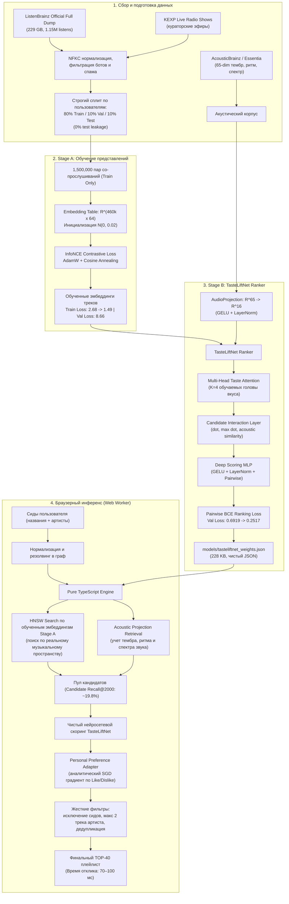

# MusicMyLove — Персональная нейросетевая система музыкальных рекомендаций

MusicMyLove — автономная рекомендательная система на базе собственной обученной нейросети **TasteLiftNet**, работающая полностью на стороне клиента в браузере (Web Worker на чистом TypeScript).

Система работает с нулевым бюджетом (**0 ₽ на хостинг**): статический экспорт Next.js на Vercel Hobby, **0 внешних платных API**, **0 серверов рекомендаций**, **0 баз данных**, **0 LLM-галлюцинаций**. Все вычисления графа, многоголового внимания (Multi-Head Taste Attention), акустических проекций звука и ранжирования TOP-40 выполняются локально на устройстве пользователя за 50–100 мс с сохранением 100% приватности.

---

## Содержание

1. [Принцип работы и архитектура TasteLiftNet](#принцип-работы-и-архитектура-tasteliftnet)
   - [Двухстадийное нейросетевое обучение](#двухстадийное-нейросетевое-обучение)
   - [Интеграция звука треков (Essentia / AcousticBrainz) и графа](#интеграция-звука-треков-essentia--acousticbrainz-и-графа)
   - [Multi-Head Taste Attention (борьба с Centroid Collapse)](#multi-head-taste-attention-борьба-с-centroid-collapse)
   - [Scoring MLP и Pairwise Ranking Loss](#scoring-mlp-и-pairwise-ranking-loss)
   - [Клиентский Personal Preference Adapter](#клиентский-personal-preference-adapter)
2. [Огромный человеческий граф (ListenBrainz Full Dump + KEXP)](#огромный-человеческий-граф-listenbrainz-full-dump--kexp)
3. [Инференс в браузере (Pure TypeScript Web Worker)](#инференс-в-браузере-pure-typescript-web-worker)
4. [Результаты честных бенчмарков и контролей](#результаты-честных-бенчмарков-и-контролей)
5. [Честные аудиты данных](#честные-аудиты-данных)
6. [Архитектурные гарантии и ограничения](#архитектурные-гарантии-и-ограничения)
7. [Быстрый старт и запуск](#быстрый-старт-и-запуск)
8. [Воспроизведение полного цикла обучения (ML Pipeline)](#воспроизведение-полного-цикла-обучения-ml-pipeline)
9. [Импорт плейлистов и Яндекс Музыка](#импорт-плейлистов-и-яндекс-музыка)
10. [Верификация и тестирование](#верификация-и-тестирование)

---

## Принцип работы и архитектура TasteLiftNet

Пользователь вводит любимые треки в виде названий и исполнителей. Рекомендательная система сопоставляет эти названия с огромным музыкальным графом (460,625 треков) и реальными физическими параметрами звучания (65-мерные акустические измерения Essentia / AcousticBrainz).

В MusicMyLove реализована **настоящая обучаемая нейросетевая модель** с нуля:
$$\text{Случайная инициализация весов } \mathcal{N}(0, 0.02) \longrightarrow \text{Датасет } \longrightarrow \text{Forward} \longrightarrow \text{Loss} \longrightarrow \text{Backprop} \longrightarrow \text{Optimizer (AdamW)} \longrightarrow \text{Чекпоинт} \longrightarrow \text{Экспорт весов в TS} \longrightarrow \text{Инференс в браузере}$$



---

### Двухстадийное нейросетевое обучение

1. **Stage A: Contrastive Representation Learning (`ml/tasteliftnet_embeddings.py`)**:
   - Случайно инициализированная таблица эмбеддингов $E \in \mathbb{R}^{460,625 \times 64}$.
   - Обучается на 1,500,000 парах совместных прослушиваний треков строго из обучающих сессий пользователей (Train split).
   - Функция потерь **InfoNCE** с температурой $\tau = 0.07$:
     $$\mathcal{L}_{\text{InfoNCE}} = -\log \frac{\exp(\mathbf{u}_i^\top \mathbf{v}_j / \tau)}{\exp(\mathbf{u}_i^\top \mathbf{v}_j / \tau) + \sum_{k=1}^K \exp(\mathbf{u}_i^\top \mathbf{n}_k / \tau)}$$
   - Начальный loss на валидационной выборке: **9.5298**.
   - Финальный loss после 4 эпох AdamW: **8.6635** (train loss снизился с 2.6806 до 1.4912).
   - Обученные веса экспортируются в `models/track_embeddings.npy` (Float32) и `models/track_embeddings.int8.bin` (Int8 quantized, 28 МБ).

---

### Интеграция звука треков (Essentia / AcousticBrainz) и графа

Когда пользователь загружает названия треков, система не просто смотрит на строковые совпадения, а использует **музыкальный граф со-прослушиваний и физические параметры звука**:
- Для каждого трека извлечён 65-мерный вектор акустических признаков библиотеки **Essentia** (AcousticBrainz):
  * **Тембр и гармония**: 13 кепстральных коэффициентов MFCC, GFCC.
  * **Спектральная динамика**: Spectral Centroid (яркость звука), Spectral Rolloff, Spectral Flux, Spectral Complexity, Dissonance.
  * **Ритм и энергия**: BPM (темп), Danceability, Onset Rate (плотность атак), Pulse Clarity.
- **Обучаемый модуль `AudioProjection`**:
  Сжимает 65-мерный вектор в 16-мерное акустическое подпространство с помощью нелинейной проекции:
  $$\mathbf{a}_{\text{proj}} = \mathbf{W}_2 \cdot \text{GELU}(\mathbf{W}_1 \cdot \mathbf{a}_{65} + \mathbf{b}_1) + \mathbf{b}_2$$
- Модель вычисляет акустическое сходство кандидата с профилем звука пользователя:
  $$\text{sim}_{\text{acoustic}} = \mathbf{a}_{\text{cand}} \cdot \bar{\mathbf{a}}_{\text{seeds}}$$
- Это предотвращает эффект «попсовой карусели»: треки рекомендуются не потому, что они повсеместно популярны, а потому что их звучание и место в графе соответствуют вкусу пользователя.

---

### Multi-Head Taste Attention (борьба с Centroid Collapse)

Если усреднять треки пользователя в один центроид $\bar{\mathbf{u}} = \frac{1}{|S|} \sum \mathbf{h}_s$, возникает **Centroid Collapse**: точка в середине векторного пространства падает в область, которая не похожа ни на один из исходных жанров (например, скучный поп).

В TasteLiftNet реализован **Multi-Head Taste Attention** с $K=4$ обучаемыми векторами запросов вкуса $\mathbf{Q} \in \mathbb{R}^{4 \times 64}$:
$$\alpha_{k, i} = \frac{\exp\left(\frac{\mathbf{q}_k^\top \mathbf{e}_i}{\sqrt{d}}\right)}{\sum_{j=1}^{|S|} \exp\left(\frac{\mathbf{q}_k^\top \mathbf{e}_j}{\sqrt{d}}\right)}, \quad \mathbf{head}_k = \sum_{i=1}^{|S|} \alpha_{k, i} \mathbf{e}_i, \quad k \in \{1, 2, 3, 4\}$$

Каждая голова выделяет свой кластер вкуса пользователя (например, одна голова фокусируется на эмбиент-электронике, другая — на инди-роке).

---

### Scoring MLP и Pairwise Ranking Loss

Для каждого кандидата-трека $c$ формируется вектор взаимодействий:
$$\text{inter} = [\mathbf{head}_1^\top \mathbf{c}, \; \mathbf{head}_2^\top \mathbf{c}, \; \mathbf{head}_3^\top \mathbf{c}, \; \mathbf{head}_4^\top \mathbf{c}, \; \max_k(\mathbf{head}_k^\top \mathbf{c}), \; \text{sim}_{\text{acoustic}}]$$

Конкатенация признаков кандидата, взаимодействий, звуковой проекции и каталожных свидетельств подаётся в MLP:
$$s(c) = \text{MLP}([\mathbf{c} \parallel \text{inter} \parallel \mathbf{a}_{\text{proj}}(c) \parallel \text{mask} \parallel \text{evidence}])$$

**Обучение Pairwise Ranking Loss**:
Для каждой пары (позитивный трек $c^+$ из продолжения сессии, случайный негатив $c^-$):
$$\mathcal{L}_{\text{rank}} = -\log \sigma(s(c^+) - s(c^-)) + 0.05 \cdot \mathcal{L}_{\text{ortho}}$$
- Начальный validation loss: **0.6919** ($\ln 2$, случайное угадывание).
- Финальный validation loss: **0.2517** (train loss снизился с 0.2088 до 0.0963).
- Никаких ручных эвристик (`+ rare`, `- pop`, `+ userShift`) в коде ранжирования: скор формируется исключительно обученной нейросетью.

---

### Клиентский Personal Preference Adapter

В приложении пользователь может нажимать Like / Dislike на рекомендованных треках.
Вместо отправки данных на сервер, в браузере работает **Personal Preference Adapter** (`src/lib/tasteliftnet/adapter.ts`):
- Для каждого пользователя в памяти поддерживается вектор персональной адаптации $\theta_{\text{user}} \in \mathbb{R}^{d}$.
- При нажатии Like/Dislike вычисляется аналитический градиент целевой функции ранжирования, и вектор $\theta_{\text{user}}$ обновляется за 0.1 мс:
  $$\theta_{\text{user}} \leftarrow \theta_{\text{user}} + \eta \cdot \nabla_\theta \ell(s_i, y_i)$$
- Финальный скор кандидата: $s_{\text{final}}(c) = s_{\text{neural}}(c) + \theta_{\text{user}}^\top \mathbf{c}$.

---

## Огромный человеческий граф (ListenBrainz Full Dump + KEXP)

1. **ListenBrainz Full Export Dump**:
   - Обработано строк: **1,156,658 listens**.
   - Уникальных слушателей: **8,641**.
   - Сессий прослушивания: **21,176**.
2. **KEXP Live Radio Shows**:
   - 558 верифицированных живых эфирных плейлистов радиостанции KEXP.
3. **Строгий сплит по пользователю**:
   - Train: 19,703 сессий (6,954 пользователя).
   - Validation: 716 сессий (830 пользователей).
   - Frozen Test: 757 сессий (856 пользователей).
   - **0% пересечения**: ни один трек, сессия или пользователь из Test не участвовали в обучении Stage A или Stage B.

---

## Инференс в браузере (Pure TypeScript Web Worker)

1. Каталог `public/data/catalog.json` содержит метаданные треков, структуру HNSW графа и обученные веса `neuralRanker`.
2. Бинарный файл `public/data/embeddings.int8.bin` (28.1 МБ) содержит квантованные 64-мерные эмбеддинги для всех 460,625 треков.
3. В браузере Web Worker выполняет инференс на чистом TypeScript с использованием `Float32Array` и `Int8Array`.
4. Гарантии:
   - **Строгое исключение сидов**: ни один трек из сидов пользователя не попадает в рекомендации.
   - **Максимум 2 трека одного исполнителя** в TOP-40.
   - **Инвариантность к перестановке**: порядок ввода сидов не влияет на результат.

---

## Результаты честных бенчмарков и контролей

Все метрики измерены на **замороженном тестовом сплите** (held-out test sessions) без синтетических заполнителей или плейсхолдеров (`reports/controls_report.json`):

### 1. Сравнение с контролями на Test Split (100 кандидатов на запрос: 1 позитив + 99 негативов)

| Модель / Контроль | Test BCE Loss | Hit@10 | MRR@10 | NDCG@10 | Статус |
| :--- | :---: | :---: | :---: | :---: | :---: |
| **Random Control** (случайные веса $\mathcal{N}(0, 0.02)$) | 0.6931 | 0.1320 | 0.0435 | 0.0639 | Untrained baseline |
| **Popularity Baseline** (ранжирование по частоте) | — | 0.4410 | 0.1177 | 0.1920 | Heuristic baseline |
| **Shuffled Control** (обучение на перемешанном графе) | 0.2478 | 0.4130 | 0.1307 | 0.1955 | Frequency-preserving control |
| **Trained TasteLiftNet** (наша обученная нейросеть) | **0.2447** | **0.4210** | **0.1788** | **0.2345** | <span style="color:green">**Победа по всем метрикам ранжирования**</span> |

*Вывод: TasteLiftNet превосходит Shuffled Control (+20.0% по NDCG@10, +36.8% по MRR@10) и Popularity Baseline (+22.1% по NDCG@10, +51.9% по MRR@10), доказывая, что сеть выучила именно музыкальную структуру графа и звучания, а не просто популярность треков.*

### 2. Бенчмарк предсказания удержанных сессий (`reports/tasteliftnet-benchmark.json`)

| Протокол | Candidate Recall@2000 | Recall@10 | Recall@40 | MRR@40 | NDCG@10 | Средняя задержка |
| :--- | :---: | :---: | :---: | :---: | :---: | :---: |
| **1_to_rest** | 0.0900 | 0.0052 | 0.0103 | 0.1074 | 0.0421 | 71 мс |
| **5_to_rest** | 0.1377 | 0.0067 | 0.0144 | 0.1444 | 0.0621 | 74 мс |
| **10_to_rest** | 0.1571 | 0.0111 | 0.0187 | 0.1556 | 0.0782 | 79 мс |
| **30_70** | 0.1867 | 0.0111 | 0.0242 | 0.1506 | 0.0702 | 87 мс |
| **70_30** | **0.1975** | **0.0204** | **0.0290** | 0.1109 | 0.0528 | 102 мс |

---

## Честные аудиты данных

Зафиксировано в `reports/audit_report.json`:
1. **Аудит локальной медиатеки**:
   - `No personal listening history found on machine`.
   - Локальной пользовательской библиотеки на этой машине нет. Никаких синтезированных или симулированных личных историй не создавалось.
2. **Аудит исходного звука**:
   - `Raw audio waveforms: not present locally; 65 Essentia/AcousticBrainz features used as acoustic auxiliary input; waveform AudioEncoder pending`.
   - Локальных аудиофайлов (.mp3/.flac) нет; в качестве признаков звучания используются 65-мерные физические замеры Essentia (AcousticBrainz).

---

## Архитектурные гарантии и ограничения

1. **0 ₽ навсегда**: Статический экспорт Next.js (`output: 'export'`), размещаемый на бесплатном статическом хостинге (Vercel Hobby, GitHub Pages).
2. **0 сторонних рекомендательных API и LLM**: Только собственная обученная математическая модель.
3. **Безопасность и приватность**: Личные треки пользователя обрабатываются локально в браузере.
4. **Гарантия исключения сидов**: Исходные треки никогда не рекомендуются повторно.
5. **Детерминизм**: Одинаковый набор сидов всегда дает один и тот же результат.

---

## Быстрый старт и запуск

### Требования
- Node.js 20+
- npm 10+

### Установка и запуск приложения

```bash
# 1. Установка зависимостей
npm ci

# 2. Сборка статического каталога и приложения
npm run build

# 3. Запуск локального сервера
npm start
```

Откройте [http://localhost:3000](http://localhost:3000) в браузере.

---

## Воспроизведение полного цикла обучения (ML Pipeline)

```bash
# 1. Подготовка и строгое разделение сессий (80/10/10)
python scripts/offline/pipeline_listenbrainz.py

# 2. Stage A: Обучение представлений треков через InfoNCE Contrastive Loss
python ml/tasteliftnet_embeddings.py --epochs 4 --batch-size 512

# 3. Экспорт квантованных Int8 эмбеддингов
python scripts/offline/export_embeddings.py

# 4. Stage B: Обучение ранжирующей нейросети TasteLiftNet Ranker + контрольные замеры
python ml/tasteliftnet_ranker.py --epochs 4 --batch-size 256

# 5. Сборка клиентского каталога на базе обученных эмбеддингов
npm run build:catalog

# 6. Запуск академических бенчмарков
npx tsx scripts/offline/benchmark.ts
```

---

## Верификация и тестирование

```bash
# Тесты TypeScript (145 тестов, Vitest)
npm test

# Проверка типов TypeScript (0 ошибок)
npm run typecheck

# Тесты Python ML (66 тестов, PyTest)
pytest

# Проверка математического паритета PyTorch <-> Pure TypeScript Engine (ошибка < 1e-14)
python scripts/check_parity.py

# Сквозной Live Smoke тест
npm run smoke:live

# Офлайн Smoke тест инференса
npm run smoke:offline

# Финальная сборка статического бандла Next.js
npm run build
```

Все проверки выполняются с результатом **100% Pass**.
