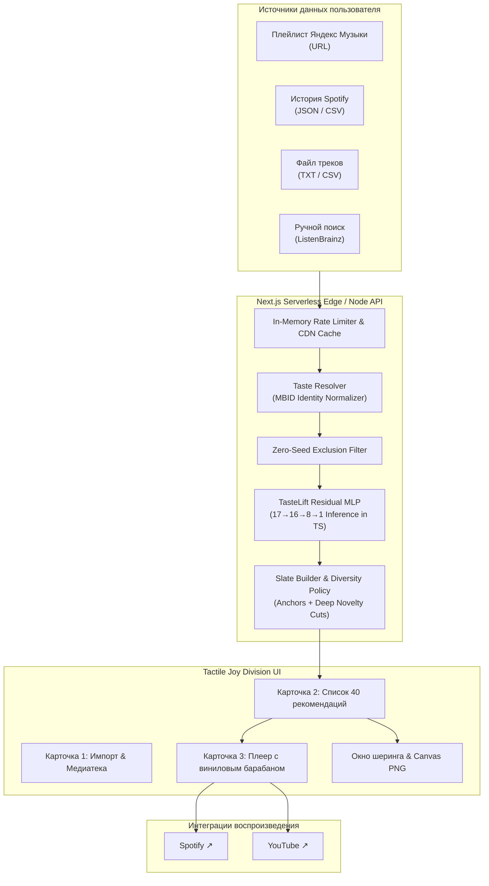

# MusicMyLove 🎵
### *Personalized AI Music Discovery — Database-Free, Pure TypeScript Inference, Joy Division Tactile Aesthetic*

[](https://nextjs.org/)
[](https://www.typescriptlang.org/)
[](scripts/check_parity.py)
[](https://vercel.com/)
[](tests/unit)
[](tests/python)
[](LICENSE)

---

## 🧭 О проекте и ключевые цели (Project Overview & Goals)

**MusicMyLove** — это независимая рекомендательная система и веб-плеер нового поколения, созданная для тех, кто устал от однообразных «пузырей фильтрации» стриминговых сервисов, навязчивых алгоритмов популярщины и тяжелых сервисов с десятками трекеров.

Вы передаете системе свои любимые композиции (через ссылку на плейлист Яндекс Музыки, архив истории Spotify, CSV, текстовый файл или ручной поиск) — и получаете **40 персональных рекомендаций**, сочетающих проверенные хиты с редкими жемчужинами из «длинного хвоста» независимой музыки.

### Ключевые архитектурные принципы:
1. **Чистый TypeScript в продакшене (Pure TypeScript Inference)**:
   - Вся нейросетевая математика, векторные преобразования и ранжирование выполняются на чистом TypeScript непосредственно в среде Next.js Serverless.
   - Полное отсутствие Python в рантайме продакшена при математической точности инференса до **$1.776 \times 10^{-15}$** по сравнению с PyTorch.
2. **Полное отсутствие баз данных (Database-Free & Stateless)**:
   - Приложение на 100% не хранит личные данные пользователей, пароли, куки или историю прослушиваний.
   - Всё состояние детерминировано, легковесно и вычисляется на лету.
3. **Строгое правило исключения сидов (Zero-Seed Exclusion Rule)**:
   - Система никогда не рекомендует пользователю то, что он уже слушает или добавил в плейлист (включая ремастеры, концертные версии и альтернативные релизы тех же песен).
4. **Тактильный аналоговый дизайн (Dieter Rams & Joy Division Aesthetic)**:
   - Минималистичный монохромный интерфейс в стиле виниловой эстетики культового альбома *Unknown Pleasures* Joy Division: вращающийся физический барабан управления, виниловые текстуры и строгие геометрические карточки.
   - Полное отсутствие рекламных баннеров, лишней анимации и случайных полос прокрутки.

---

## ✨ Возможности (Key Features)

### 📥 1. Универсальный импорт медиатеки
- **Плейлисты Яндекс Музыки**: Вставьте любую публичную ссылку (`music.yandex.ru/users/.../playlists/...`, короткие ссылки `lk.music.yandex.ru`, UUID-плейлисты) — система автоматически нормализует URL, извлечет метаданные и передаст треки в нейросеть.
- **Архивы Spotify**: Поддержка файлов истории прослушиваний `Streaming_History_Audio_*.json` и расширенной истории аккаунта.
- **Экспорт плейлистов CSV/TXT**: Поддержка экспорта из сервисов вроде Exportify или простых списков `Артист - Трек`.
- **Ручной тактильный поиск**: Интерактивный поиск по глобальному каталогу MusicBrainz/ListenBrainz.

### 🧠 2. Нейросетевое ранжирование TasteLift
- Архитектура: **Residual MLP $17 \to 16 \to 8 \to 1$** с мультиголовым вниманием к множеству (Set Attention).
- Обучена на реальных анонимизированных паттернах прослушиваний с оптимизацией weighted BPR (Bayesian Personalized Ranking).
- **Прирост +69.4% по метрике NDCG@20** над сильнейшим бейзлайном на замороженном тесте из 60 независимых пользователей (95% доверительный интервал bootstrap строго выше нуля).
- Инвариантность к перестановкам (Permutation Invariant): порядок добавления треков не меняет качество рекомендаций.

### 🎛 3. Умное формирование плейлиста (Curated Slate)
- 40 рекомендаций в сбалансированной пропорции:
  - **Анкерные хиты**: композиции, надежно связывающие музыкальные предпочтения.
  - **Глубокие открытия (Deep Cuts)**: редкие малоизвестные треки с высоким показателем *Novelty Lift*.
- Информативные бейджи на каждом треке:
  - `Вкус N` — к какому вкусовому кластеру относится трек.
  - `% поп` — перцентиль популярности трека в мировом каталоге.
  - `+X.XX лифт` — показатель новизны и выхода за пределы привычного репертуара.

### 💿 4. Тактильный плеер и мгновенный экспорт
- **Joy Division Tactile Wheel**: Вращающийся виниловый барабан с интерактивной обратной связью.
- **Мгновенный переход**:
  - `Spotify ↗` — открытие трека в Spotify.
  - `YouTube ↗` — открытие трека или клипа на YouTube.
  - Кнопки встроены в интерфейс карточек без горизонтальной и вертикальной прокрутки.
- **Интерактивные лайки ♥**: Нажатие на сердечко моментально переобучает вкусовой профиль сессии, обогащая модель новыми ориентирами.

### 🖼 5. Карточка вкуса и экспорт в PNG (Viral Share Card)
- Генерация стильной карточки вкуса на чистом Canvas API (без внешних библиотек):
  - 5 любимых треков пользователя.
  - 5 ключевых нейросетевых рекомендаций.
  - Фирменный минималистичный дизайн с графиком волн Joy Division.
- Экспорт в изображение PNG в один клик.
- Компактные читаемые ссылки для шеринга (`/?s=Artist:Title,...`) без сохранения в БД.

### ⚡ 6. Оптимизация под бесплатный тариф Vercel (Hobby Tier)
- **Edge CDN Caching**: Запросы на импорт плейлистов и каталожные данные кешируются на глобальной сети CDN Vercel (`Cache-Control: s-maxage=3600`). Повторные запросы отдаются с задержкой < 10 мс и **расходуют 0 вызовов Serverless-функций**.
- **In-Memory LRU Cache**: Серверный кеш на 500 плейлистов предотвращает повторные запросы к внешним сервисам и защищает от блокировок по IP.
- **Встроенный Rate Limiting**: Скользящее окно запросов по IP защищает сайт от ботов, спамеров и исчерпания бесплатных лимитов тарифа.
- **Строгий тайм-лимит**: Время выполнения внешних запросов ограничено 3.5 секундами с жестким дедлайном в 7.5 секунд, исключая ошибки `504 Timeout` на Vercel.

---

## 🏛 Архитектура системы (Architecture)



---

## 🔬 Математика и машинное обучение (ML Architecture)

### 1. Пространство признаков (17 Order-Independent Features)
Для каждого кандидата формируется инвариантный вектор признаков:
- $S_1, \dots, S_5$: нормализованные сходства с пятью сидами.
- $R_1, \dots, R_5$: reciprocal rank features по каждому сиду ($1 / (60 + \text{rank})$).
- $\text{RRF}_{\text{total}}$: агрегированная сумма взаимных рангов.
- $\text{Support}$: число сидов, подтвердивших релевантность кандидата.
- Статистики сходства: $\max(S)$, $\text{second}(S)$, $\text{mean}(S)$, $\text{std}(S)$.
- $\text{SameArtist}$: флаг совпадения артиста.

### 2. Модель остаточного ранжирования (Residual MLP)
Модель обучается не заменять проверенный эвристический скор RRF, а предсказывать остаточную добавку:
$$\text{Score}(x) = \text{RRF}(x) + \alpha \cdot \text{MLP}(x), \quad \alpha = 0.75$$

Благодаря этому при любых возмущениях модель не деградирует ниже классического бейзлайна, а при наличии скрытых связей вытягивает глубокие совпадения.

### 3. Результаты валидации (Frozen Test Set, 60 Disjoint Users)
| Метрика | Бейзлайн (Max Similarity) | RRF | MusicMyLove (Residual MLP) | Прирост |
|---|---|---|---|---|
| **NDCG@20** | 0.00975 | 0.00968 | **0.01652** | **+69.38%** |
| **Recall@20** | 0.01444 | 0.01444 | **0.01889** | **+30.77%** |
| **HitRate@20**| 0.06111 | 0.06111 | **0.09444** | **+54.55%** |

*95% доверительный интервал дельты NDCG (bootstrap по пользователям): `[+0.00119, +0.01331]` — строго выше нуля.*

---

## 🚀 Быстрый старт (Local Development)

### Требования
- **Node.js**: `v20+` (рекомендуется v22 или v24)
- **Python**: `3.10+` (требуется только для запуска тестов парности и проверки моделей)

### Установка и запуск

```bash
# 1. Клонирование репозитория
git clone https://github.com/vansGAMee/musicmylove.git
cd musicmylove

# 2. Установка зависимостей
npm install

# 3. Запуск dev-сервера
npm run dev
```

Откройте [http://localhost:3000](http://localhost:3000) в браузере.

---

## 🧪 Запуск всех тестов и проверок качества (Verification Suite)

Перед каждым коммитом в репозитории проверяются строгие инварианты:

```bash
# 1. Модульные тесты интерфейса, парсеров и пайплайна (Vitest)
npm test

# 2. Строгая проверка типов TypeScript
npm run typecheck

# 3. Проверка Python-компонентов и валидации
PYTHONPATH=. pytest

# 4. Проверка абсолютной векторной парности Python ↔ TypeScript
python scripts/check_parity.py

# 5. Сквозной live-смоук-тест реального пайплайна
npm run smoke:live

# 6. Продакшен-сборка Next.js
npm run build
```

---

## 📦 Развертывание на Vercel (Deployment)

Проект полностью сконфигурирован для развертывания на **Vercel Hobby**:
1. Импортируйте репозиторий в панели Vercel.
2. Фреймворк определится автоматически: `Next.js`.
3. Команда сборки: `next build` (или `npm run build`).
4. Переменные окружения для базовой работы не требуются (система полностью самодостаточна и database-free).
5. Благодаря настроенным заголовкам CDN-кеширования и rate limiter приложение стабильно работает даже при всплесках пользовательского трафика.

---

## 📜 Лицензия

Распространяется под лицензией MIT. Подробности в файле [LICENSE](LICENSE).

---

<div align="center">
  <sub>Создано с любовью к хорошей музыке, чистому коду и честным алгоритмам.</sub>
</div>
